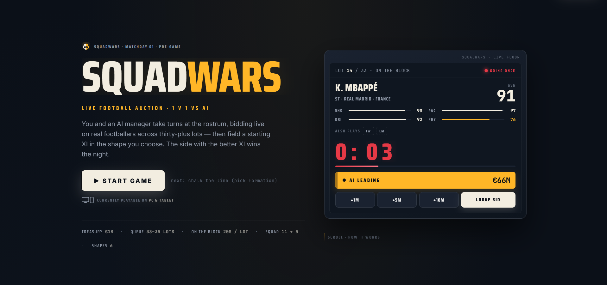
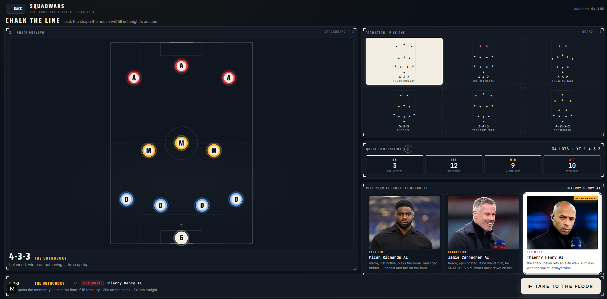
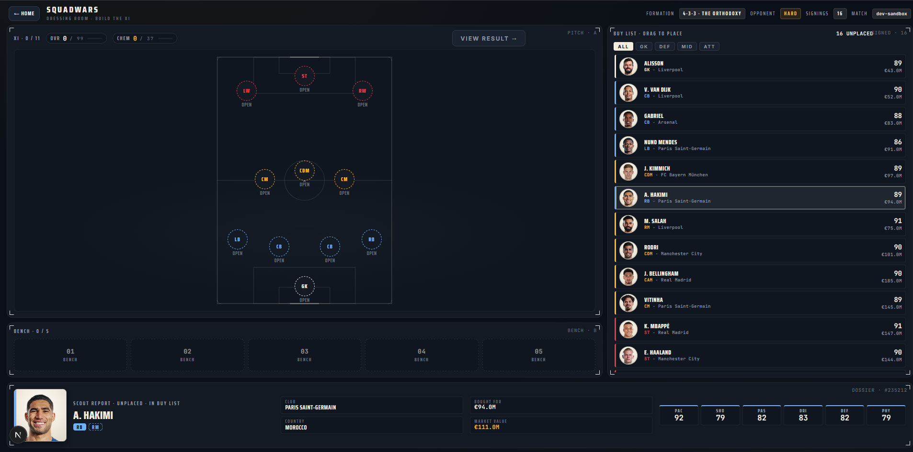

<div align="center">

# ⚽ SquadWars

### A real-time 1v1 football auction game — you versus a scheming AI manager.

Bid live on real footballers, build a starting XI in the shape you choose, and let the better team take the night.

<br/>

[](https://squadwars.online)
&nbsp;
[](https://x.com/ShivanshSi0203)

<br/>


<br/>

**[Play](https://squadwars.online)** · **[How it works](#-how-to-play)** · **[Opponents](#-meet-the-opponents)** · **[Tech](#-tech-stack)** · **[Architecture](#-architecture)** · **[Run locally](#-getting-started)**

</div>

<br/>



---

## 🎬 Gameplay

<div align="center">

[](readme_assets/gameplay.mp4)

<sub>▶️ **Click the banner to watch the full gameplay walkthrough** (`readme_assets/gameplay.mp4`)</sub>

</div>

<!--
  Want an INLINE, auto-playing player instead of a click-through?
  GitHub does not render <video> or repo-relative videos inside a README.
  Drag readme_assets/gameplay.mp4 (or the smaller output.mp4) into any GitHub
  issue/PR comment, copy the generated https://github.com/user-attachments/assets/...
  URL, and paste that bare URL on its own line right here.
-->

---

## 🏟️ What is SquadWars?

SquadWars is a one-sitting football management duel. There's no grind, no second legs, no sign-up — just a single, tense auction against an AI that actually schemes.

You and an AI manager take turns at the rostrum, bidding live on **real footballers** across **~33 lots**. Every player is **on the block for 20 seconds** — going once, going twice, gavel. You start with a **€1B treasury** and have to fill a **16-player squad** (a starting **XI of 11** plus a **5-man bench**) in the **formation you chose** before kickoff.

The twist is what you *can't* see: **you never see the AI's squad, and you never see who comes up next.** You bid on instinct and on whatever you can read from the bidding. At full time both squads are scored on **overall rating + chemistry**, and the better side takes the night.

> **You** are always chalk-white. **The AI** is always floodlight-amber. One match, one verdict.

---

## 🎮 How to Play

### ① Chalk your shape
Pick one of **six formations** and the **opponent** you want to face. The chalk pitch re-draws itself as you switch shapes — your formation decides exactly which positions you'll need to fill at the floor.



### ② Take to the floor
Players come up one lot at a time, **20 seconds each**. Lodge a bid; the AI fires back; the banner flips to whoever leads. Outbid the machine for a player you need — or let it overpay and bank your treasury for later. You're bidding **blind**: no team sheet, no queue preview.

### ③ Build the XI
Drag your signings into your shape — **11 starters + 5 bench**. Links form between players who share a **club or nation**, brewing **chemistry** that lifts the whole side. A clever, well-linked sixteen can beat a pile of mismatched superstars.



### ④ Full time
Both XIs are scored on **overall rating + chemistry**. The better team takes the night. No replays, no extra time — one auction, one squad, one result.

---

## 🎭 Meet the Opponents

Three AI managers, three temperaments at the rostrum — each a pundit persona driven by an LLM that plans its budget, reads the board, and snipes at the death.

| Opponent | Mode | Temperament |
|---|---|---|
| **Micah Richards** ⭐ *recommended first match* | `TEST HIM` | Warm, instinctive, plays the room. A balanced bidder — honest and fair on the floor. |
| **Jamie Carragher** | `AGGRESSIVE` | Fierce and opinionated. If he wants him, he **snatches** him. Won't back down on his picks. |
| **Thierry Henry** | `GOD MODE` | The shark. Never lets an elite walk, ruthless with the wallet, plans many moves ahead. |

---

## ✨ Features

- ⚽ **Real footballers** — accurate ratings, clubs and nations across a deep pool of elite players.
- 🧠 **An AI that schemes** — it reads the board, hunts the gaps in your shape, and bids at the death. Three personas, three difficulties.
- 🔗 **Chemistry links** — shared club and nation wire your XI together for bonus points; a balanced side beats a more expensive one.
- 🧩 **Six tactical shapes** — from the orthodox 4-3-3 to a back-five shell. Pick an identity, then sign the players to fill it.
- ⏱️ **20-second lots** — real auction-house pressure. Going once. Going twice.
- 🌫️ **Fog of war** — you never see the opposition's squad or the next lot. Read the room.
- 🏆 **One match, one verdict** — overall rating + chemistry decides the night.
- 📱 **Free to play** — no sign-up, playable on PC & tablet.

---

## 🛠️ Tech Stack

**Frontend** — deployed on **Vercel** ([squadwars.online](https://squadwars.online))
- **Next.js 16** (App Router, Turbopack) + **React 19** + **TypeScript**
- **@dnd-kit** for the drag-and-drop squad builder
- A bespoke design system — *broadcast football meets the auction house* — built with hand-rolled CSS, no UI library

**Backend** — deployed on **Cloudflare Workers**
- **Hono 4** — the web framework / router
- **Durable Objects** (SQLite-backed) — one stateful instance per match holds the live auction
- **Cloudflare KV** + native **rate-limiting binding** — abuse protection
- **DeepSeek LLM** (via the OpenAI SDK) — drives the AI manager's budget planning
- **Zod** for validation, **nanoid** for match IDs

---

## 🏗️ Architecture

```
                        ┌──────────────────────────────────────┐
   Browser              │  Frontend · Next.js 16 (Vercel)       │
  (PC / tablet)  ◄────► │  squadwars.online                     │
                        │  • formation picker · live auction    │
                        │  • dnd squad builder · result screen  │
                        └───────────────┬──────────────────────┘
                                        │  HTTPS · per-match session token
                                        ▼
                        ┌──────────────────────────────────────┐
                        │  Backend · Hono on Cloudflare Workers │
                        │  worker.ts → routes → MatchDO         │
                        │                                       │
                        │   ┌───────────────────────────────┐   │
                        │   │  Durable Object (per matchId)  │   │
                        │   │  • holds the AuctionMatch state │   │
                        │   │  • single-threaded, persisted   │   │
                        │   │  • self-deletes 24h after start │   │
                        │   └───────────────┬───────────────┘   │
                        │        KV (rate)  │  waitUntil         │
                        └───────────────────┼───────────────────┘
                                            ▼
                                  ┌──────────────────┐
                                  │  DeepSeek LLM     │  ← AI budget / cap planning
                                  └──────────────────┘
```

### How it fits together

#### The stateless edge

The Worker is a pure front door — it holds **no match state**. It handles CORS (credentialed, **exact-origin echo**, no wildcards), runs a native rate-limit binding over `/api/match/*` that **fails open** (a limiter must never take down the game), applies a separate KV-backed limiter to match *creation*, mints a `nanoid` match id, and routes every other request to that match's Durable Object via `idFromName(matchId)`. Same id → same instance, every time.

#### One Durable Object per match

Each `matchId` resolves to a single `MatchDO` running in its **own isolate**, owning the entire auction — budgets, the player queue, the AI's bid plan, the final result. Two properties fall out for free:

- **No cross-instance locking.** Matches are fully isolated; one match can never contend with another.
- **Ordered mutations.** Inside the instance a promise-chain mutex serializes every state change, so two bids landing in the same millisecond resolve deterministically — no torn state.

It hydrates from storage on cold start (`blockConcurrencyWhile`), persists after every mutation, and arms a storage **alarm that deletes the match 24 hours after creation** — no cron, no cleanup job, no orphaned rows. SQLite-backed Durable Objects mean all of this runs on the Cloudflare **free tier**.

#### The clock lives in the browser

The lot countdown runs **client-side**; when it hits zero the browser calls `/lot-end`. So the server runs **zero gameplay timers** — which is exactly what keeps it on the free tier. But a client-owned clock is a cheat surface, so the server never trusts it:

- `/lot-end` is **time-validated** server-side (with ~1s of clock-skew slack) and returns **`425 Too Early`** if called before the lot can legally close.
- Every response carries `serverNow` so the client can correct for drift.
- **Anti-snipe:** a bid in the last 5 seconds pushes the deadline out by 7 — you can't steal a lot on the buzzer.

#### Server authority & anti-cheat

The server is the single source of truth, and the design assumes a hostile client:

- **The AI's max bid for each lot is a server secret** — computed and stored inside the DO, **never sent to the client**, so you can't read it out of a network response.
- **Fog of war by construction.** `toClientDTO()` strips the upcoming queue, the AI's signings (you see only a *count*), and every internal secret. Both squads are revealed **only** in the result phase.
- **Stale actions are rejected** — a bid or AI-fire carrying an out-of-date `lotIndex`/`planId` gets a `409` or is ignored.
- **Session-bound matches.** A match is tied to a ~192-bit session token issued at creation and authenticated via an `x-sw-session` header (a `*.workers.dev` cookie is third-party and blocked by many browsers). A *shared or leaked match URL carries no token* — it just `403`s instead of hijacking the creator's match.
- **The reconciliation shot.** Because the AI's bid is triggered by a client timer, a cheater could simply *never fire it*. So at lot close, if the AI isn't already winning, the server takes **one guaranteed bid for it, up to its secret cap.** Suppressing the AI's network call gains you nothing — you still can't win a player below what the AI was willing to pay. This is the keystone that makes a client-driven clock safe.

#### The AI has two brains

Bid valuations come from a fast deterministic layer with an LLM on top — never the LLM *alone*:

- **Heuristic floor (always on):** a cap of `floor(overall² / 80)`, clamped to 80% of the AI's remaining budget. Instant, free, and good enough to stand on its own.
- **DeepSeek refinement:** a **synchronous seed** at match creation blocks lot 1 just long enough to open with a real plan; then after every lot an **async refresh** runs through `ctx.waitUntil` to price the next couple of lots — with a lookahead window scaled by difficulty (Micah sees 2 lots ahead, Carragher 5, Henry 10). The actual bid amount is **recomputed on the server at fire time** — the client timer only decides *when* to ask, never *how much*.
- **Prompt caching:** the system prompt is static; persona, difficulty, lookahead and win-mandate all ride in the user-message JSON, keeping DeepSeek's prompt cache **~75–80% warm**. Per-match token cost is tracked end to end (`/debug`).

#### Deterministic verdict, LLM as narrator

The result is **math, not vibes.** Five categories — attack / midfield / defence plus chemistry, each with positional-fit penalties for fielding a player out of role — are scored deterministically for both sides. *Only then* is the LLM handed those final numbers to write the match report and the roast, so **it narrates the verdict; it never decides it.** Every LLM touchpoint (bid caps, the AI's XI pick, the prose) has a deterministic fallback — an outage degrades flavour, never breaks a match.

#### Built to become multiplayer

`AuctionMatch` is written to strict "DO discipline": one instance per id, all mutation through methods, a clean `serialize`/`restore` boundary, secrets kept out of the client DTO. A live 1v1-vs-human mode is therefore **a wrapper change, not a rewrite** — the room already *is* a Durable Object; it just needs a second human wired to the same instance.

#### API surface

| Endpoint | Purpose |
|---|---|
| `POST /api/match` | Create a match, mint the id, seed the AI's opening plan |
| `GET  …/state` | Fog-of-war-filtered snapshot (poll / reconnect) |
| `POST …/start` | Open the first lot |
| `POST …/bid` | Lodge a user bid (validated, anti-sniped) |
| `POST …/ai-fire` | Client timer asks the server to resolve the AI's move |
| `POST …/lot-end` | Close the lot (time-checked), resolve the winner, chain the next |
| `POST …/result` | Submit your XI, compute the verdict |

---

## 📁 Project Structure

```
bestsquad/
├── client/                 # Next.js 16 frontend (deployed to Vercel)
│   └── app/
│       ├── page.tsx                 # landing — scrolling broadcast narrative
│       ├── setup/                   # "chalk the line" — formation & opponent
│       ├── auctionroom/[slug]/      # the live auction floor
│       ├── squad-builder/           # drag-and-drop XI builder + result screen
│       └── r/[token]/               # shareable result cards (OG images)
│
├── server/                 # Hono + Cloudflare Workers backend
│   ├── src/
│   │   ├── worker.ts                # Worker entry / router
│   │   ├── do/MatchDO.ts            # the per-match Durable Object
│   │   ├── match/                   # AuctionMatch engine + player pool
│   │   ├── llm/                     # DeepSeek integration
│   │   ├── middleware/              # session auth + rate limiting
│   │   ├── routes/ · schemas/       # endpoints + Zod validation
│   │   └── config.ts                # all gameplay tunables
│   └── wrangler.toml                # Workers / DO / KV config
│
├── docs/DEPLOYMENT.md      # full deploy & ops handoff
└── readme_assets/          # screenshots + gameplay video
```

---

## 🚀 Getting Started

### Prerequisites
- **Node.js 20+**
- A **DeepSeek API key** (for the AI manager — the game still runs on the heuristic fallback without one)

### 1 · Frontend

```bash
cd client
npm install
npm run dev          # → http://localhost:3000
```

Environment (optional in dev — sensible defaults are baked in):

| Variable | Default | Purpose |
|---|---|---|
| `NEXT_PUBLIC_BACKEND_URL` | `http://localhost:8787` | Where the client calls the backend |
| `NEXT_PUBLIC_SITE_URL` | `https://squadwars.online` | Canonical URL for OG/sitemap |

### 2 · Backend

```bash
cd server
npm install
npm run dev          # wrangler dev → http://localhost:8787
```

Create `server/.dev.vars` (gitignored) for local secrets:

```
AI_KEY=your_deepseek_api_key
```

Non-secret config (`CORS_ORIGIN`, `NODE_ENV`) lives in `wrangler.toml`. For production, set the secret with `wrangler secret put AI_KEY`.

Open **http://localhost:3000**, take to the floor, and enjoy. 🎉

---

## ☁️ Deployment

| Layer | Platform | Command |
|---|---|---|
| Frontend | **Vercel** | `cd client && vercel --prod` |
| Backend | **Cloudflare Workers** | `cd server && npm run deploy` |

The backend ships as a single Worker plus a SQLite-backed Durable Object and a KV namespace — all on Cloudflare's free tier. Full step-by-step ops notes live in **[`docs/DEPLOYMENT.md`](docs/DEPLOYMENT.md)**.

---

## 🗺️ Roadmap

- ✅ Real-time **1v1 vs AI** — live
- 🔜 More formations, deeper chemistry rules, expanded player pool
- 🧪 **Online 1v1 multiplayer** — exploring (the Durable Object architecture is built for it)

---

## 👤 Author

Built solo, for the love of the game, by **Shivansh Singh**.

[](https://x.com/ShivanshSi0203)
[](https://github.com/shivanshsin0203)

---

<div align="center">

**[▶ Take to the floor — squadwars.online](https://squadwars.online)**

<sub>A real-time 1v1 football auction · made for the love of the game.</sub>

</div>
